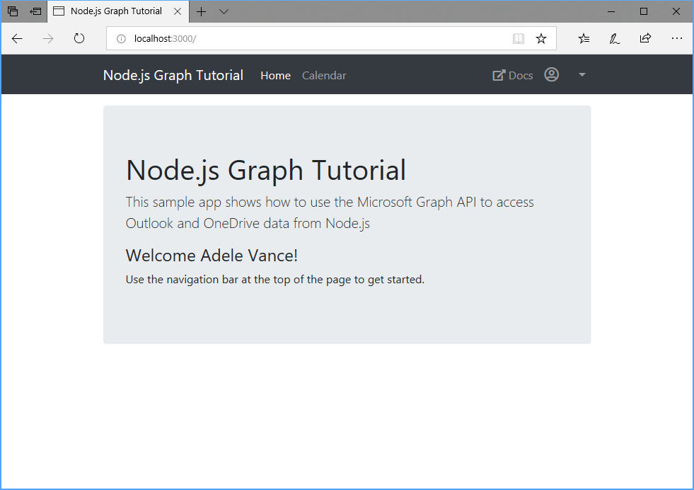

<!-- markdownlint-disable MD002 MD041 -->

В этом упражнении вы будете расширяем приложение из предыдущего упражнения для поддержки проверки подлинности с помощью Azure AD. Это необходимо для получения необходимого маркера доступа OAuth для вызова Microsoft Graph. На этом этапе в приложение будет интегрирована библиотека [msal – node](https://github.com/AzureAD/microsoft-authentication-library-for-js/tree/dev/lib/msal-node) .

1. Создайте файл с именем **. env** в корневом каталоге приложения и добавьте следующий код.

    :::code language="ini" source="../demo/graph-tutorial/example.env":::

    Замените `YOUR_CLIENT_SECRET_HERE` идентификатором приложения на портале регистрации приложений и замените на `YOUR_APP_SECRET_HERE` созданный секрет клиента.

    > [!IMPORTANT]
    > Если вы используете систему управления версиями (например, Git), то теперь будет полезно исключить файл **env** из системы управления версиями, чтобы избежать непреднамеренного утечки идентификатора и пароля приложения.

1. Откройте файл **./app.js** и добавьте следующую строку в начало файла, чтобы загрузить **env** -файл.

    ```javascript
    require('dotenv').config();
    ```

## <a name="implement-sign-in"></a>Реализация входа

1. Откройте строку `var indexRouter = require('./routes/index');` в файле **./app.js**. Вставьте следующий код **перед** строкой.

    :::code language="javascript" source="../demo/graph-tutorial/app.js" id="MsalInitSnippet":::

    Этот код инициализирует библиотеку msal – node с ИДЕНТИФИКАТОРом и паролем приложения.

1. Создайте новый файл в каталоге **./раутес** с именем **auth.js** и добавьте следующий код.

    ```javascript
    var router = require('express-promise-router')();

    /* GET auth callback. */
    router.get('/signin',
      async function (req, res) {
        const urlParameters = {
          scopes: process.env.OAUTH_SCOPES.split(','),
          redirectUri: process.env.OAUTH_REDIRECT_URI
        };

        try {
          const authUrl = await req.app.locals
            .msalClient.getAuthCodeUrl(urlParameters);
          res.redirect(authUrl);
        }
        catch (error) {
          console.log(`Error: ${error}`);
          req.flash('error_msg', {
            message: 'Error getting auth URL',
            debug: JSON.stringify(error, Object.getOwnPropertyNames(error))
          });
          res.redirect('/');
        }
      }
    );

    router.get('/callback',
      async function(req, res) {
        const tokenRequest = {
          code: req.query.code,
          scopes: process.env.OAUTH_SCOPES.split(','),
          redirectUri: process.env.OAUTH_REDIRECT_URI
        };

        try {
          const response = await req.app.locals
            .msalClient.acquireTokenByCode(tokenRequest);

          // TEMPORARY!
          // Flash the access token for testing purposes
          req.flash('error_msg', {
            message: 'Access token',
            debug: response.accessToken
          });
        } catch (error) {
          req.flash('error_msg', {
            message: 'Error completing authentication',
            debug: JSON.stringify(error, Object.getOwnPropertyNames(error))
          });
        }

        res.redirect('/');
      }
    );

    router.get('/signout',
      async function(req, res) {
        // Sign out
        if (req.session.userId) {
          // Look up the user's account in the cache
          const accounts = await req.app.locals.msalClient
            .getTokenCache()
            .getAllAccounts();

          const userAccount = accounts.find(a => a.homeAccountId === req.session.userId);

          // Remove the account
          if (userAccount) {
            req.app.locals.msalClient
              .getTokenCache()
              .removeAccount(userAccount);
          }
        }

        // Destroy the user's session
        req.session.destroy(function (err) {
          res.redirect('/');
        });
      }
    );

    module.exports = router;
    ```

    Этот параметр определяет маршрутизатор с тремя маршрутами: `signin` , `callback` , и `signout` .

    `signin`Маршрут вызывает `getAuthCodeUrl` функцию для создания URL-адреса входа, а затем перенаправляет браузер на этот URL-адрес.

    `callback`Маршрут выполняет перенаправление Azure после завершения входа. Код вызывает `acquireTokenByCode` функцию для обмена кодом авторизации для маркера доступа. После получения маркера он перенаправляется обратно на домашнюю страницу с маркером доступа во временном значении ошибки. Мы будем использовать эту проверку, чтобы убедиться, что наш вход работает перед переходом. Перед тестированием необходимо настроить приложение Express для использования нового маршрутизатора с **./раутес/auth.js**.

    `signout`Метод записывает пользователя и уничтожает сеанс.

1. Откройте **app.js** и вставьте приведенный ниже код **перед** `var app = express();` строкой.

    ```javascript
    var authRouter = require('./routes/auth');
    ```

1. Вставьте следующий код **после** `app.use('/', indexRouter);` строки.

    ```javascript
    app.use('/auth', authRouter);
    ```

Запустите сервер и перейдите к `https://localhost:3000` . Нажмите кнопку входа, и вы будете перенаправлены на `https://login.microsoftonline.com` . Войдите с помощью учетной записи Майкрософт и согласия с запрошенными разрешениями. Браузер перенаправляется на приложение, отображая маркер.

### <a name="get-user-details"></a>Получение сведений о пользователе

1. Создайте в корневом каталоге проекта новый файл с именем **graph.js** и добавьте следующий код.

    ```javascript
    var graph = require('@microsoft/microsoft-graph-client');
    require('isomorphic-fetch');

    module.exports = {
      getUserDetails: async function(accessToken) {
        const client = getAuthenticatedClient(accessToken);

        const user = await client
          .api('/me')
          .select('displayName,mail,mailboxSettings,userPrincipalName')
          .get();
        return user;
      },
    };

    function getAuthenticatedClient(accessToken) {
      // Initialize Graph client
      const client = graph.Client.init({
        // Use the provided access token to authenticate
        // requests
        authProvider: (done) => {
          done(null, accessToken);
        }
      });

      return client;
    }
    ```

    При этом экспортируется `getUserDetails` функция, которая использует пакет SDK Microsoft Graph для вызова `/me` конечной точки и возврата результата.

1. Откройте **/раутес/auth.js** и добавьте приведенные ниже `require` операторы в начало файла.

    ```javascript
    var graph = require('../graph');
    ```

1. Замените существующий маршрут обратного вызова на следующий код.

    :::code language="javascript" source="../demo/graph-tutorial/routes/auth.js" id="CallbackSnippet" highlight="13-23":::

    Новый код сохраняет идентификатор учетной записи пользователя в сеансе, получает сведения о пользователе из Microsoft Graph и сохраняет его в хранилище пользователя приложения.

1. Перезапустите сервер и пройдите процесс входа. Необходимо вернуться на домашнюю страницу, но пользовательский интерфейс должен измениться, чтобы показать, что вы вошли в систему.

    

1. Щелкните аватар пользователя в правом верхнем углу, чтобы получить доступ к ссылке **выхода** . При нажатии кнопки **выйти** сбрасывается сеанс и возвращается на домашнюю страницу.

    

## <a name="storing-and-refreshing-tokens"></a>Хранение и обновление маркеров

На этом шаге приложение имеет маркер доступа, который отправляется в `Authorization` заголовке вызовов API. Это маркер, который позволяет приложению получать доступ к Microsoft Graph от имени пользователя.

Однако этот маркер кратковременно используется. Срок действия маркера истечет через час после его выдачи. В этом случае маркер обновления становится полезен. В спецификации OAuth представлен маркер обновления, который позволяет приложению запросить новый маркер доступа, не требуя от пользователя повторного входа.

Так как приложение использует пакет msal-Node, не требуется реализовывать логику хранения или обновления маркеров. Приложение использует используемый по умолчанию кэш маркеров msal-узла в памяти, который достаточно для примера приложения. Рабочие приложения должны предоставить собственный [подключаемый модуль кэширования](https://github.com/AzureAD/microsoft-authentication-library-for-js/blob/dev/lib/msal-node/docs/configuration.md) для сериализации кэша маркеров на надежном, надежном носителе.
