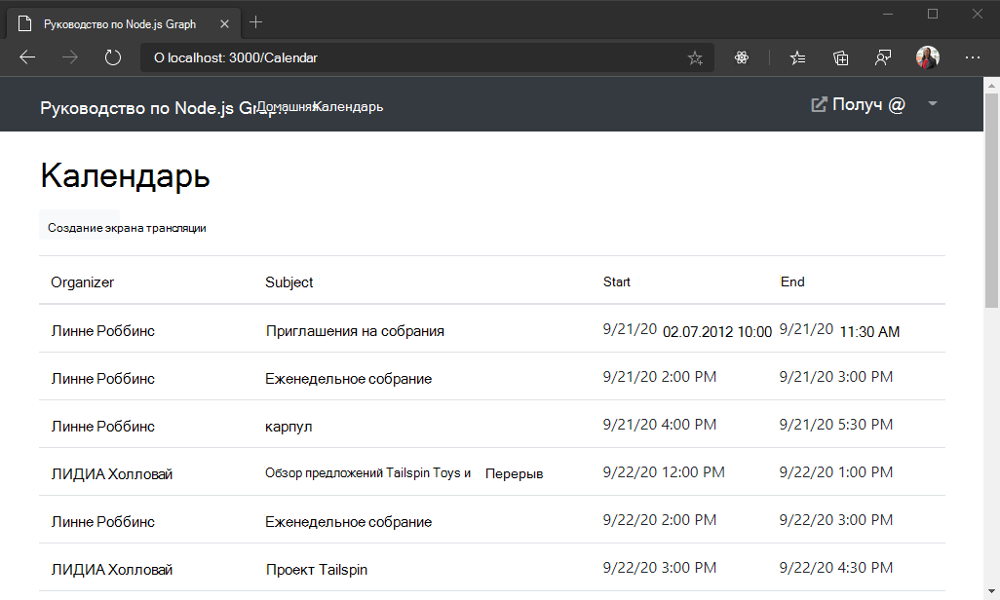

<!-- markdownlint-disable MD002 MD041 -->

В этом упражнении вы добавите в приложение Microsoft Graph. В этом приложении для совершения вызовов в Microsoft Graph будет использоваться [Клиентская библиотека Microsoft](https://github.com/microsoftgraph/msgraph-sdk-javascript) Graph.

## <a name="get-calendar-events-from-outlook"></a>Получение событий календаря из Outlook

1. Откройте `./graph.js` и добавьте указанную ниже функцию `module.exports`в поле.

    :::code language="javascript" source="../demo/graph-tutorial/graph.js" id="GetEventsSnippet":::

    Рассмотрите, что делает этот код.

    - URL-адрес, который будет вызываться — это `/me/events`.
    - `select` Метод ограничит поля, возвращаемые для каждого события, только теми, которые будут реально использоваться в представлении.
    - `orderby` Метод сортирует результаты по дате и времени создания, начиная с самого последнего элемента.

1. Создайте новый файл в `./routes` каталоге с именем `calendar.js`и добавьте приведенный ниже код.

    ```javascript
    var express = require('express');
    var router = express.Router();
    var tokens = require('../tokens.js');
    var graph = require('../graph.js');

    /* GET /calendar */
    router.get('/',
      async function(req, res) {
        if (!req.isAuthenticated()) {
          // Redirect unauthenticated requests to home page
          res.redirect('/')
        } else {
          let params = {
            active: { calendar: true }
          };

          // Get the access token
          var accessToken;
          try {
            accessToken = await tokens.getAccessToken(req);
          } catch (err) {
            res.json(err);
          }

          if (accessToken && accessToken.length > 0) {
            try {
              // Get the events
              var events = await graph.getEvents(accessToken);

              res.json(events.value);
            } catch (err) {
              res.json(err);
            }
          }
          else {
            req.flash('error_msg', 'Could not get an access token');
          }
        }
      }
    );

    module.exports = router;
    ```

1. Обновите `./app.js` , чтобы использовать этот новый маршрут. Добавьте указанную ниже **before** строку перед `var app = express();` строкой.

    ```javascript
    var calendarRouter = require('./routes/calendar');
    ```

1. Добавьте следующую строку **после** `app.use('/auth', authRouter);` строки.

    ```javascript
    app.use('/calendar', calendarRouter);
    ```

1. Перезапустите сервер. Войдите и щелкните ссылку **Календарь** на панели навигации. Если все работает, вы должны увидеть дамп событий JSON в календаре пользователя.

## <a name="display-the-results"></a>Отображение результатов

Теперь вы можете добавить представление для отображения результатов более удобным для пользователя способом.

1. Добавьте следующий код `./app.js` **после** `app.set('view engine', 'hbs');` строки.

    :::code language="javascript" source="../demo/graph-tutorial/app.js" id="FormatDateSnippet":::

    В этом случае реализуется [вспомогательный модуль handlebars](http://handlebarsjs.com/#helpers) для форматирования даты ISO 8601, возвращаемой Microsoft Graph, в нечто более удобное для человека.

1. Создайте новый файл в `./views` каталоге `calendar.hbs` и добавьте указанный ниже код.

    :::code language="html" source="../demo/graph-tutorial/views/calendar.hbs" id="LayoutSnippet":::

    Это приведет к перебору коллекции событий и добавлению строки таблицы для каждой из них.

1. Теперь обновите маршрут в `./routes/calendar.js` поле, чтобы использовать это представление. Замените существующий маршрут следующим кодом.

    :::code language="javascript" source="../demo/graph-tutorial/routes/calendar.js" id="GetRouteSnippet" highlight="16-19,26,28-31,37":::

1. Сохраните изменения, перезапустите сервер и войдите в приложение. Щелкните ссылку **Календарь** , после чего приложение должно отобразить таблицу событий.

    
